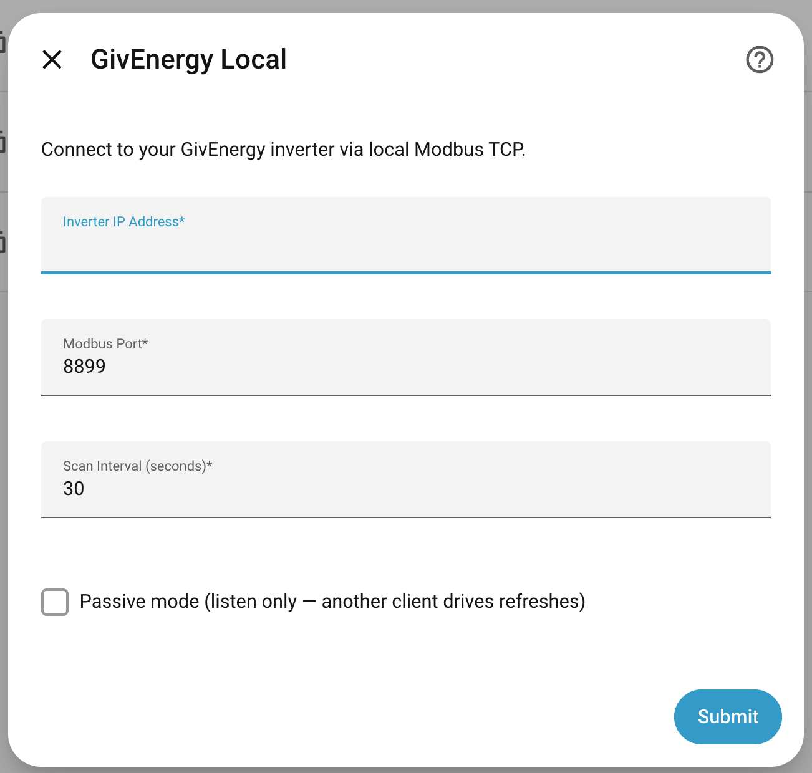
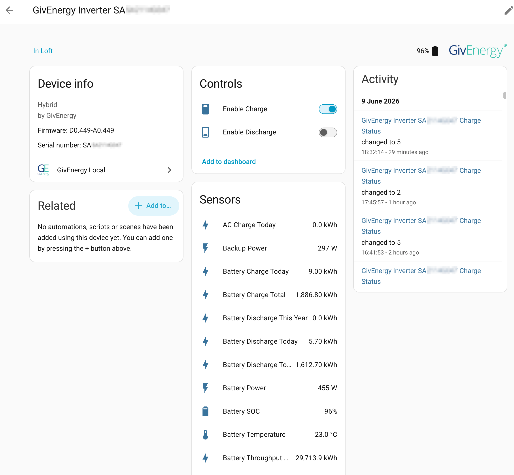
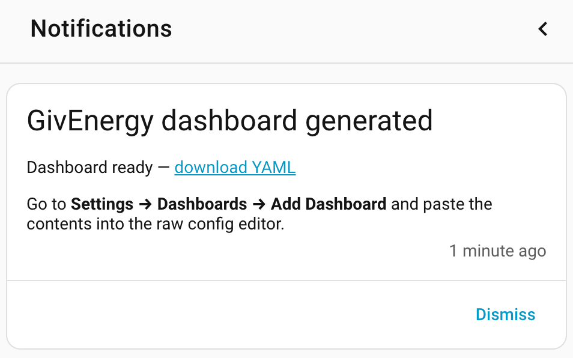

# GivEnergy Home Assistant Integration

<p align="center"></p>

[](https://github.com/dewet22/givenergy-hass/releases)
[](https://github.com/dewet22/givenergy-hass/actions?query=branch%3Amain)
[](LICENSE)
[](https://github.com/astral-sh/ruff)
[](https://hacs.xyz/docs/use/repositories/dashboard)

A Home Assistant integration for GivEnergy inverters that communicates directly over local Modbus TCP — no cloud, no GivEnergy portal account required.

Uses [`givenergy-modbus`](https://github.com/dewet22/givenergy-modbus) for all inverter communication.

## Requirements

- A [supported GivEnergy inverter](#supported-inverters) connected to your local network (wifi or ethernet), with the Modbus TCP port reachable from your Home Assistant server (default port **8899**)
- Home Assistant 2026.5 or later (requires Python 3.14, which HA 2026.5+ ships)

## Supported inverters

The integration uses [`givenergy-modbus`](https://github.com/dewet22/givenergy-modbus) v2.0, which models the following device families: single-phase hybrid, three-phase hybrid, AC-coupled, EMS, Gateway, and All-in-One. Register maps for all of these shipped in v2.0, but empirical verification is still in progress for most — the mappings were brought in from the GivTCP fork, which ran across a wide range of hardware, so the coverage is broad but not all of it has been confirmed against wire data.

Confirmed working:

- Hybrid single-phase (Gen 1)
- AC-coupled (Gen 1)

The following have modelled register maps and are expected to work, but would benefit from owner validation — if yours is one of these and you run into sensor values that look wrong, please [open an issue](https://github.com/dewet22/givenergy-hass/issues):

- Hybrid three-phase
- All-in-One (AIO)
- EMS controller
- Gateway (V1 / V2)
- HV battery stacks (BCU/BMU)

If you'd like to help validate, a wire-frame capture is the most useful thing you can include. If you already have the integration running, use the built-in service from **Developer Tools → Services**:

```
Service: givenergy_local.capture_frames
Duration: 60
```

This records a redacted copy of the raw Modbus traffic (serial numbers zeroed), saves it to `/local/`, and sends a notification with a download link. Attach the file to the issue along with your inverter model and serial prefix.

If you don't yet have the integration installed, [givenergy-cli](https://github.com/dewet22/givenergy-cli) can produce a structured register dump instead:

```bash
uv run givenergy-cli --host <inverter-ip> export -o plant.json
```

## Installation

### HACS (recommended)

[](https://my.home-assistant.io/redirect/hacs_repository/?owner=dewet22&repository=givenergy-hass&category=integration)

Or if that doesn't work:

1. In HACS, go to **Integrations → Custom repositories**
2. Add `https://github.com/dewet22/givenergy-hass` and select category **Integration**
3. Install **GivEnergy Local** and restart Home Assistant

### Installing a beta / pre-release via HACS

New features often ship as a pre-release (e.g. `v1.1.0rc4`) before a stable release. To install one:

1. Open **GivEnergy Local** in HACS, then the **⋮ menu (top-right) → Redownload**
2. Expand **"Need a different version?"**
3. Pick the pre-release from the **Release** dropdown (they're tagged with a **pre-release** badge)
4. **Download**, then **restart Home Assistant** (custom-component changes only apply after a restart)

### Manual

1. Download [`givenergy_local.zip`](https://github.com/dewet22/givenergy-hass/releases/latest/download/givenergy_local.zip) from the latest release
2. Extract its contents into your Home Assistant `config/custom_components/givenergy_local/` folder
3. Restart Home Assistant

## Configuration

Add the integration via **Settings → Devices & Services → Add Integration → GivEnergy Local**.



| Field | Default | Description |
|---|---|---|
| Inverter IP Address | — | Local IP of the inverter's data adapter |
| Modbus Port | `8899` | Modbus TCP port |
| Scan Interval | `30` s | How often HA polls for updated values |
| [Passive mode](#passive-mode) | off | Listen only — use when another local polling client is already driving the inverter and this integration should just observe |

To change any of these later, open the integration's **⋮** menu in **Settings → Devices & Services → GivEnergy Local** and choose **Reconfigure**. The integration reloads automatically when you save.

### Running alongside other local polling clients

Both this integration and other local polling solutions (GivTCP, the GivEnergy app, custom scripts) can run in active mode at the same time without issue. The inverter handles concurrent Modbus clients reliably — earlier reports of polling conflicts were largely a consequence of retry and error-recovery behaviour in the older shared library, not an inverter limitation. Running multiple clients in parallel has been solid in practice, even at faster-than-default poll intervals.

#### GivTCP long-term stats migration

Running both integrations in parallel makes it easy to evaluate a switch without committing: you get a live side-by-side comparison and can cut over at your own pace. A script to migrate your long-term recorder statistics from GivTCP entity IDs to the new ones is in progress — see [`docs/migration-from-givtcp.md`](docs/migration-from-givtcp.md) — so there will be a clear path to carrying your energy history across when you're ready.

#### Passive mode

When enabled, the integration connects to the inverter but sends no Modbus read requests after the initial connection. Instead, it reads the library's register cache on each scan interval tick. This is a secondary option for setups where you'd prefer this integration to observe rather than poll — the main case being a client you can't reconfigure (e.g. the GivEnergy app) where you want to avoid any overlap.

## Entities



### Inverter device

#### Sensors

| Entity | Unit | Notes |
|---|---|---|
| PV Power | W | Combined PV output |
| PV String 1 / 2 Power | W | Per-string power |
| PV String 1 / 2 Voltage | V | |
| PV String 1 / 2 Current | A | |
| PV Energy Today | kWh | |
| PV Energy Total | kWh | |
| Battery SOC | % | |
| Battery Power | W | Positive = discharging, negative = charging |
| Battery Voltage / Current | V / A | |
| Battery Temperature | °C | |
| Battery Charge Today | kWh | |
| Battery Discharge Today | kWh | |
| Battery Throughput Total | kWh | |
| Grid Power | W | Positive = exporting, negative = importing |
| Grid Export / Import Today | kWh | |
| Grid Export / Import Total | kWh | |
| AC Voltage / Frequency | V / Hz | |
| Load Power | W | |
| Load Energy Today | kWh | |
| Inverter Output Today / Total | kWh | |
| Inverter Heatsink Temperature | °C | |
| Charger Temperature | °C | |
| Status | — | e.g. Normal, Warning, Fault |
| Fault Code | — | |
| Inverter Errors | — | Diagnostic; error bitmask |
| Charger Warning Code | — | Diagnostic |
| Charge Status | — | Diagnostic; raw int (BMS state code, mapping TBD) |
| System Mode | — | Diagnostic; raw int (operating mode, mapping TBD) |
| AC Output Voltage / Frequency / Current | V / Hz / A | Diagnostic; inverter output (post-conversion) |
| Grid Apparent Power | VA | Diagnostic |
| Inverter Power Factor | — | Diagnostic |
| Grid Power Phase 1 | W | Diagnostic; useful for 3-phase models |
| Inverter Export Total | kWh | Cumulative inverter export to grid |
| Charge from Grid Total | kWh | Cumulative grid-sourced battery charging |
| Battery Discharge This Year | kWh | |
| Backup Power | W | EPS port output |
| Combined Generation Power | W | Solar + battery combined |
| Work Time Total | h | |
| Device Type Code | — | Diagnostic |
| MPPT Count | — | Diagnostic |
| Phase Count | — | Diagnostic; 1 for single-phase, 3 for three-phase |
| ARM / DSP / Modbus Firmware Version | — | Diagnostic |
| Meter Type | — | Diagnostic; CT-or-EM418 / EM115 |
| Battery Type | — | Diagnostic; Lithium / Lead-Acid |
| Battery Capacity | Ah | Diagnostic; reported pack capacity |
| Battery Nominal Capacity | kWh | Diagnostic; computed from Ah × nominal voltage |
| Last Successful Refresh | timestamp | Diagnostic |
| Consecutive Refresh Failures | — | Diagnostic; resets to 0 on next success |
| Total Refresh Failures | — | Diagnostic; ever-increasing counter (resets only when HA restarts — HA's long-term statistics handle that transparently) |

#### Controls

| Entity | Type | Notes |
|---|---|---|
| Enable Charge | Switch | |
| Enable Discharge | Switch | |
| Charge Target SOC | Number | 4–100 % |
| Battery SOC Reserve | Number | 4–100 % |
| Battery Charge Limit | Number | 0–50 % |
| Battery Discharge Limit | Number | 0–50 % |
| Battery Discharge Min Power Reserve | Number | 4–100 % |
| Battery Power Mode | Select | Export / Self Consumption |
| Battery Pause Mode | Select | Disabled / Pause Charge / Pause Discharge / Pause Both |
| Charge Slot 1 & 2 Start / End | Time | |
| Discharge Slot 1 & 2 Start / End | Time | |
| Battery Pause Slot Start / End | Time | Active window for the pause mode above |


### Battery device(s)

Each connected battery pack appears as a separate device linked to the inverter. On All-in-One (AIO) hardware, devices are surfaced at pack level only — the individual module sub-devices that some other tools expose are not yet represented ([#95](https://github.com/dewet22/givenergy-hass/issues/95)).

| Entity | Unit | Notes |
|---|---|---|
| SOC | % | |
| Voltage | V | Pack output voltage |
| Temperature Max / Min | °C | |
| Remaining Capacity | Ah | |
| Design Capacity | Ah | |
| Charge Cycles | — | |
| Cell Count | — | Diagnostic; number of cells the BMS reports |
| Cell Voltages Sum | V | Diagnostic; sanity-check against Voltage |
| BMS MOSFET Temperature | °C | Diagnostic |
| Cell 1 … 16 Voltage | V | Diagnostic; per-cell. Unused positions in smaller packs read ~0 |
| Cells 1-4 / 5-8 / 9-12 / 13-16 Temperature | °C | Diagnostic; the BMS samples one thermistor per 4-cell group |

Cell-level entities are tagged as diagnostic, so they're hidden from the default device view but available for dashboards and pack-health monitoring (cell voltage spread, temperature deltas, etc.).

### Services

The integration registers the following services under the `givenergy_local` domain. All are accessible from **Developer Tools → Services** or from automations.

| Service | Description |
|---|---|
| `givenergy_local.generate_dashboard` | Generates a topology-aware Lovelace dashboard YAML for your inverter and battery configuration, saves it to `/local/`, and sends a persistent notification with a download link. Import via **Settings → Dashboards → Add Dashboard**. Accepts an optional `max_power_kw` parameter (default 10). |
| `givenergy_local.expose_recommended_entities` | Exposes an opinionated headline set of entities (battery SOC, PV/grid/load power, today's and lifetime energy totals, inverter status) to one or more voice/LLM assistants. Defaults to the `conversation` assistant (Assist, the LLM tools API, MCP-via-conversation); pass `assistants` to override. See **Voice assistants & LLM access** below. |
| `givenergy_local.redetect_plant` | Clears the cached plant topology for the inverter and reloads the integration, forcing a full hardware-detection sweep. Use after adding or removing a battery. Requires a `device_id`. |
| `givenergy_local.capture_frames` | Captures raw Modbus wire frames for a configurable duration (10–300 s, default 60 s), writes a redacted copy to `/local/`, and sends a download link via persistent notification. Serial numbers are zeroed before the file is written. Attach the file to a GitHub issue when reporting connectivity problems. |
| `givenergy_local.reboot_inverter` | Sends the inverter reboot command. Requires a `device_id`. |
| `givenergy_local.calibrate_battery_soc` | Triggers a BMS SOC calibration cycle. Requires a `device_id`. |


After running `generate_dashboard`, a notification appears with a download link:



If the dashboard schema is updated in a future release, the integration raises a fixable HA Repairs issue — click **Fix** to regenerate automatically with your settings preserved.


The generated YAML is a snapshot of your entity IDs at the moment it runs. Home Assistant 2026.6 onwards builds entity IDs from the device's area (so a device in "Loft" gets `sensor.loft_givenergy_inverter_…`), and Home Assistant doesn't rewrite existing dashboards when entities are renamed. So if you move a device between areas, rename entities, or use **Recreate entity IDs**, just run `generate_dashboard` again afterwards to re-point the cards.

### Dashboard strategy (live, self-maintaining)

To avoid that snapshot problem entirely, there's also a dashboard *strategy* that builds the same six-tab layout but resolves every entity from the registry each time the dashboard loads — so it doesn't go stale when a device moves area or an entity is renamed. I added it because the static YAML kept silently rotting on my own install after area reassignments. To use it, create a new dashboard, open the **raw configuration editor**, and set the whole config to:

```yaml
strategy:
  type: custom:givenergy
  mode: classic        # classic (default) | flow — see below
  max_power_kw: 10     # optional; default 10; Overview 24h chart y-axis envelope (kW)
  serial: SA2114G047   # optional; pin one inverter on a multi-plant install
```

The strategy and the bundled cell-heatmap card are served by the integration itself, so there's nothing extra to install for them. `power-flow-card-plus` and `apexcharts-card` are still needed for the Overview/Energy charts (install them via **HACS → Frontend**); where they're missing the strategy shows a short placeholder rather than a broken card. `generate_dashboard` remains available as an editable static starting point if you'd rather hand-tweak a copy.

One caveat worth knowing: on a **hard refresh** (Ctrl/Cmd+Shift+R, which bypasses the browser cache) the dashboard may occasionally show "Error loading the dashboard strategy: Timeout waiting for strategy element …". This is a Home Assistant limitation common to all network-loaded dashboard strategies — HA gives the strategy module a fixed 5-second window to register, and a cold re-fetch can lose that race when it's queued behind other custom-card resources. A normal reload serves the module from cache and isn't affected, so it doesn't bite in day-to-day use; if you do hit it, reload again.

#### `mode: flow`

`mode: flow` leads the dashboard with an immersive, full-width **Flow** view — an animated power-flow diagram (solar, grid, battery, home) with the live direction of each flow derived from the sign of the underlying power sensors, three big-number headers, and a today-totals strip. It's a bundled custom card (`custom:givenergy-flow`), so nothing extra to install. The full `classic` view set (Overview, Energy, Batteries, Battery Health, Controls, Diagnostics) follows behind it, so you lose nothing by switching.

```yaml
strategy:
  type: custom:givenergy
  mode: flow
```

The Flow view is rendered as a `panel: true` view. If you have the **kiosk-mode** custom integration installed (HACS), the strategy adds hints to hide the header and sidebar for a true full-screen display; without it, the view simply renders inside the normal HA chrome. The card is responsive (container-query based), so it works as a wall-tablet kiosk and reflows for a phone webview.

The remaining directions from [the redesign brief](docs/design/dashboard-redesign-brief.md) — `glance`, `analyst`, and the tariff-aware `coach` — are still to come.

### Voice assistants & LLM access

Home Assistant's voice assistants (Assist) and LLM tools (Claude / OpenAI via MCP) can only see entities that are explicitly **exposed**. HA auto-exposes a curated allowlist of sensor device classes — `temperature`, `humidity`, and a few others — but `power`, `energy`, and `battery` are **not** on that list, so none of this integration's headline sensors are visible to voice or LLM queries by default. Asking "what's my battery at?" silently returns nothing until you fix it.

#### Option 1: run the `expose_recommended_entities` service (recommended)

From **Developer Tools → Services**, pick **GivEnergy Local: Expose recommended entities to voice assistants**, choose your inverter device, and run it. You'll get a persistent notification listing what was exposed. The service is idempotent — re-run any time without losing manual customisations (it only ever exposes; it never un-exposes).

By default it targets the `conversation` assistant, which covers Assist, the LLM tools API, and MCP-via-conversation. Pass `assistants` to also target `cloud.alexa` or `cloud.google_assistant`.

The opinionated set covers ~17 entities, scoped to the questions a voice user actually asks:

| Question | Entities |
|---|---|
| "What's my battery at?" / "Is it charging?" | Battery SOC, Battery Power |
| "How much did I charge/discharge today?" | Battery Charge Today, Battery Discharge Today, Battery Throughput |
| "Am I generating?" / "Solar today?" / "Lifetime PV?" | PV Power, PV Energy Today, PV Energy Total |
| "Importing or exporting?" / "Today and lifetime grid?" | Grid Power, Grid Import Today, Grid Export Today, Grid Import Total, Grid Export Total |
| "What's the house using?" | Load Power, Load Today |
| "Lifetime inverter output?" | Inverter Output Total |
| "Is everything ok?" | Inverter Status |

Topology variation is handled implicitly: PV-only installs simply skip the battery entries, and three-phase inverters use the same keys.

#### Option 2: expose manually

Go to **Settings → Voice assistants → Expose** and tick the entities you want. The list above is a good starting set.

#### Suggested aliases

Default entity names like `GivEnergy Inverter SA1234G123 Battery SOC` are unwieldy for voice. After exposing, open each entity's voice-assistants tab (**Settings → Devices & Services → GivEnergy Local → \<entity\> → Aliases**) and add short aliases. A conservative starting set:

| Entity | Suggested aliases |
|---|---|
| Battery SOC | `battery`, `battery level` |
| Battery Power | `battery power` |
| PV Power | `solar`, `panels`, `pv` |
| PV Energy Today | `solar today`, `pv today` |
| Grid Power | `grid` |
| Grid Import Today | `import today` |
| Grid Export Today | `export today` |
| Load Power | `load`, `house power` |

Aliases are deliberately not shipped by the integration: the entity-registry alias field has no provenance marker, so we can't distinguish "we set this" from "the user set this" — which means we couldn't preserve user edits cleanly across restarts. Add only the aliases that match your household's vocabulary; less is usually more, since each alias becomes its own intent-match candidate.

#### Why these aren't auto-exposed

HA's conversation agent filters sensor entities by `device_class` against an allowlist tied to its intent matchers; `power`, `energy`, and `battery` aren't on the list. There's no `_attr_*` an integration can set to override this — exposure is intentionally a user-controlled decision. Background: [community thread on Assist auto-exposure](https://community.home-assistant.io/t/wth-are-all-new-entities-exposed-to-assist-by-default/803889).

### Not exposed by default

The upstream library makes ~180 inverter fields available; this integration intentionally exposes the subset that's useful for end users without being unsafe or noisy. Deliberately skipped for now:

- `enable_*` flags for low-level inverter behaviour (buzzer, RTC, BMS read, frequency derating, auto-judge battery type, …) — changing these from a UI toggle is rarely what you actually want
- Battery calibration registers, voltage-adjust trims, low-voltage force-charge timers
- Charge / discharge slots 3 - 10 and their per-slot SOC stops (slots 1 and 2 cover typical Eco/Timed usage)
- Admin / destructive actions: inverter reboot, BMS flash update, auto-test triggers, ARM-chip select, user-code register
- Raw debug fields (internal bus voltages, countdown timers, `debug_inverter`)
- Per-phase three-phase data beyond `Grid Power Phase 1` and the three-phase balance registers

If any of these would genuinely help your setup, [open an issue](https://github.com/dewet22/givenergy-hass/issues) describing the use case — the field probably can be exposed with a single description entry, but it's nicer to have a concrete reason to do it. The same applies if a sensor we *do* expose looks wrong on your inverter — **real-world testing on non-Hybrid Gen 1 hardware (AC, AC3, EMS, Gateway, All-in-One) is especially appreciated**, and a frame capture from your unit goes a long way (see [Supported inverters](#supported-inverters) for how to produce one).

## Energy dashboard

All cumulative-energy entities (kWh) are exposed with `device_class=energy` and `state_class=total_increasing`, so Home Assistant generates long-term statistics for them automatically and they show up directly in the Energy dashboard's entity picker.

### Required: energy sensors (kWh, for the dashboard graphs)

| Dashboard slot | Entity |
|---|---|
| Solar production | `PV Energy Today` (or per-string `PV String 1/2 Energy Today` if you'd rather track MPPTs individually) |
| Grid consumption | `Grid Import Today` |
| Return to grid | `Grid Export Today` |
| Home battery — energy going IN | `Battery Charge Today` |
| Home battery — energy coming OUT | `Battery Discharge Today` |

The dashboard derives household consumption automatically from the above. If you'd like to track it directly as a sanity check, `Load Energy Today` measures the total household demand fed by the inverter and can be added under "Individual devices".

### Optional: power sensors (W, for the "Now" live view)

The dashboard's live view shows current power flow between solar, grid, battery and load. Wire these in once the energy mappings above are in place:

| Dashboard slot | Entity | Sign convention |
|---|---|---|
| Solar power | `PV Power` | Positive when producing |
| Grid power | `Grid Power` | Positive = exporting, negative = importing |
| Battery power | `Battery Power` | Positive = discharging, negative = charging |
| Household demand | `Load Power` | This would be universally positive, unless you have another generation source |

The daily counters reset at midnight; Home Assistant's recorder detects the reset automatically thanks to the `total_increasing` state class, so deltas across day boundaries are accounted for correctly.

## Troubleshooting

- **Transient connection drops are normal.** TCP-level timeouts and the occasional connection reset get logged at WARNING level and the next scan tick re-establishes the connection. The `Last Successful Refresh` and `Consecutive Refresh Failures` diagnostic sensors will tell you if something more persistent is going on.
- **"Register cache unchanged" failures in passive mode** mean no peer client is refreshing the inverter. Switch back to active mode, or start the other client that's supposed to be driving the bus.
- **Conflicts with another Modbus client** — concurrent active polling is generally reliable on current firmware; if you do see persistent connection errors with two clients running, [passive mode](#passive-mode) may help.
- **Wrong number of battery devices appearing** — battery count is auto-discovered at startup by probing the Modbus bus; there is no manual override. If detection misfires (e.g. a battery was slow to respond), reloading the integration usually fixes it. If the count is consistently wrong, [open an issue](https://github.com/dewet22/givenergy-hass/issues/48) and attach a frame capture (see [Supported inverters](#supported-inverters)).

For anything else, please [open an issue](https://github.com/dewet22/givenergy-hass/issues) with the relevant HA log lines and your inverter model.

## License

Apache License 2.0 — see [LICENSE](LICENSE).

## Development

This project uses [uv](https://docs.astral.sh/uv/) for dependency management.

After cloning, run the setup script once:

```bash
./scripts/setup.sh     # managed Python + dependencies + pre-commit hook
```

This provisions the uv-managed Python pinned in `.python-version`, installs the
dev dependencies, and wires the [prek](https://prek.j178.dev) pre-commit hook.
The hook step is per-clone — git never clones `.git/hooks` — and prek must be
installed separately (e.g. `brew install prek`); if it's missing the script
prints how to install it and stops short of wiring the hook. The hooks are
local-only; CI runs HACS + hassfest, not these checks.

Day-to-day commands:

```bash
uv sync --dev          # install dependencies
uv run pytest          # run tests
uv run ruff check .    # lint
uv run mypy custom_components/  # type-check
```

The dev environment requires Python 3.14.2 or later — `pyproject.toml` pins this to match HA Core's own lock-file floor and to keep transitive Dependabot alerts (pillow, cryptography) off the resolver. The integration runtime itself only needs whatever Python 3.14.x your Home Assistant install ships with.
