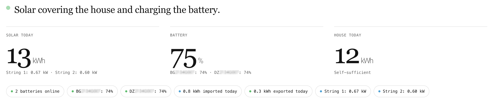
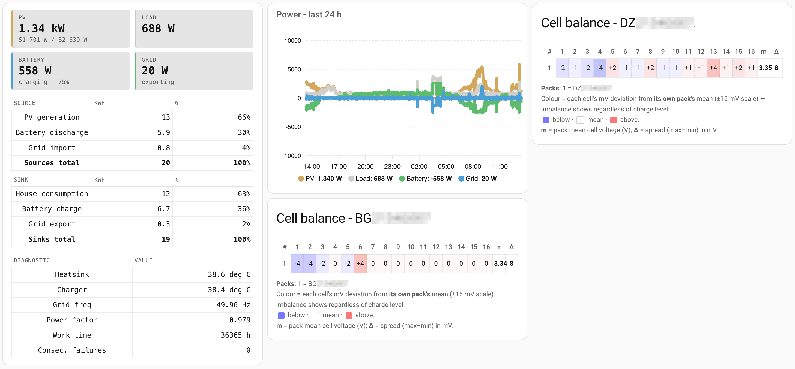

# Release notes

Human-readable notes for each release, newest first. From v1.1.5 onward the release
tag carries only a short summary and links here for the full notes and screenshots;
opening the file at a tag's pinned ref (`…/blob/vX.Y.Z/RELEASE_NOTES.md`) lands on
that release. For releases prior to v1.1.0, see the
[GitHub Releases](https://github.com/dewet22/givenergy-hass/releases) page.

---

## v1.2.0

**Per-module All-in-One battery data**

All-in-One systems now surface each removable battery module as its own device, parented
to the AIO inverter and identified by the module's serial. Each module exposes its 24
per-cell voltages and per-cell temperatures as diagnostic sensors, mirroring the existing
LV battery cell entities — so the cell-balance heatmap and pack-health views work at
module granularity. Validated end-to-end on a real four-module unit
([#95](https://github.com/dewet22/givenergy-hass/issues/95)).

**All-in-One device identity fixed**

On AIO systems the inverter could collapse into one of the battery module devices: the
underlying library adopted the inverter's serial from whichever device replied last in
the poll cycle, and on an AIO that is usually a module. givenergy-modbus 2.2 fixes this
at the source — only the inverter's own address updates its serial — so the inverter now
reliably appears as its own device with the modules linked beneath it. If you ran an
early 1.2.0 pre-release, remove and re-add the integration once to clear any stale
entities left on a module by the old behaviour.

**Capture access hardened**

A full security review of the integration ([published in the repo](docs/security-review-2026-06-10.md))
found no exploitable vulnerabilities, and its two defence-in-depth observations are
implemented here: the wire-capture views now require an admin bearer token or one of the
integration's own signed links (a signed link is bound to a single capture — the landing
page no longer offers the capture history), and capture files are written readable by
the Home Assistant user only. The capture notification also opens its landing page in a
new tab, fixing a click that previously bounced off Home Assistant's frontend router to
the dashboard.

**Grid power split for the Energy Dashboard**

New always-positive **Grid Power Import** and **Grid Power Export** sensors suit the
Energy Dashboard's "Two sensors" grid-power option directly — previously the single
signed Grid Power sensor needed the dashboard's "Inverted" helper, which started its
long-term statistics from scratch. The signed sensor still exists (the flow dashboard
uses it) but is hidden by default on new installs. Grid import/export *energy* totals
were already separate sensors and are unchanged.

**givenergy-modbus 2.2**

The integration moves to the library's 2.2 line: a typed per-device plant model (the
foundation for the per-module battery work), a unified inverter-serial accessor, a full
security audit of the library itself, and commit-time rejection of a known data-corruption
pattern where the WiFi dongle briefly serves all-zero register blocks — last-good values
are kept instead of zeros reaching your sensors.

**Highlights if you're coming from v1.1.0 or earlier**

The 1.1.x point releases added more than their patch numbers suggest — most visibly the
live dashboard. The `custom:givenergy` dashboard strategy (v1.1.3) builds the full
dashboard from the live entity registry on every render, so it never goes stale when
devices move areas or entities are renamed, and it gained three full-screen modes: an
animated energy-flow panel (`mode: flow`, v1.1.4), a calm summary panel (`mode: glance`)
and a dense diagnostics view (`mode: analyst`) (both v1.1.5), with the cell-balance
heatmap card bundled — nothing extra to install. The static `generate_dashboard` service
was deprecated and removed in its favour (v1.1.6). The same span added the debug-capture
landing page (v1.1.2), an EMS export power limit control and a battery out-of-spec alert
sensor (v1.1.2), missing-device resilience with fixable repairs (v1.1.6), GivTCP
migration support for HA 2026.6's area-prefixed entity IDs (v1.1.6), and a fix for
spurious recorder warnings on House Consumption Today (v1.1.7). Full details in the
sections below.

---

## v1.1.7

**House Consumption Today: spurious recorder warnings fixed**

The House Consumption Today sensor is derived from several Modbus registers (PV generation, grid import, grid export, AC charge) polled within the same scan cycle. When one register updates a fraction ahead of the others the computed total can dip by a few Wh, and HA's strictly-increasing guard logs a warning and corrupts the accumulated daily statistic.

The fix applies a stateful monotonic filter on the sensor: the entity tracks the intra-day maximum and returns `max(new, session_max)` instead of the raw value, making transient dips invisible to the recorder. The filter resets at midnight in HA's configured timezone so the genuine daily counter reset passes through as a real decrease and a new energy cycle begins. Two supplementary guards cover edge cases: a 0.5 kWh drop threshold detects an inverter clock that lags HA's midnight by one poll interval (emitting one more "yesterday" reading before rolling over), and last-known state is restored on HA restart so the first post-restart reading can't undercut the recorder's prior value.

---

## v1.1.6

**Missing-device resilience**

When a battery BMS is slow to answer a topology probe — the scenario that originally
prompted this work, where a pack was physically present and responding but missed one
detection window — the integration now retries before accepting the loss. If the device
still doesn't answer after retries, the previous (fuller) topology is kept rather than
being overwritten: the missing device's entities show as unavailable instead of
disappearing, and a fixable ERROR repair appears in the Repairs panel. The integration
retries automatically on each poll cycle (at most once every five minutes), and the
repair clears itself as soon as the device is seen again. No user action is normally
needed; the Fix button is there for genuinely removed hardware and triggers the same
fresh detection as the Re-detect plant topology service.

**GivTCP migration: HA 2026.6 area-prefixed entity IDs**

Home Assistant 2026.6 began prepending a device's assigned area to its auto-generated
entity IDs (e.g. `sensor.loft_givenergy_inverter_…` instead of
`sensor.givenergy_inverter_…`). The `scripts/migrate_from_givtcp.py` resolver now
handles this, so `--apply` writes to the correct prefixed statistics IDs rather than
orphaned canonical ones. The script detects whether area-prefixing is in effect from the
live entity registry and adapts automatically.

**generate_dashboard service removed**

The static YAML dashboard generator is gone. The live `custom:givenergy` strategy
supersedes it entirely and doesn't suffer the entity-ID drift that left static snapshots
stale after area reassignments. Any lingering *Dashboard outdated* repair notices clear
automatically on next load. If you're still on a generated static dashboard, switch by
setting a dashboard's raw config to `strategy: { type: custom:givenergy }`.

---

## v1.1.5

The dashboard strategy gains two new full-screen modes — **Glance** and **Analyst** —
alongside the existing `flow` and `classic` layouts, plus a fix to the flow diagram's
centre labels.

**Glance mode**

A new `mode: glance` option for the `custom:givenergy` dashboard strategy leads with a calm, full-viewport Glance panel: a single-sentence system summary, three large numbers (solar generated today, battery state-of-charge, house consumption today), and a row of health pills covering battery count, the day's grid import and export totals, and per-string PV generation when active. It's built around a new bundled `custom:givenergy-glance` element — nothing extra to install — and every value is resolved through the entity registry, consistent with the rot-immunity approach introduced in v1.1.3. Set `strategy: { type: custom:givenergy, mode: glance }`.

The summary sentence is derived from the live signs of grid, battery, and solar power, covering states like self-sufficient, exporting, importing on solar-and-grid, and battery-only overnight. The status dot pulses green when the system is self-sufficient or exporting, and amber when importing from the grid or when battery SOC drops below 20%. Like flow mode, the Glance view is a full panel and picks up kiosk-mode hints when that integration is present.

**Analyst mode**

A new `mode: analyst` option leads with a dense Analyst view aimed at optimisation and debugging: a live metrics strip (PV, load, battery, grid), an energy ledger breaking today's sources and sinks down as kWh and percentages, a diagnostics table (temperatures, grid frequency, power factor, work time, consecutive failures), a 24-hour power overlay chart (requires `apexcharts-card`), and per-pack cell heatmaps. It's a standard (non-panel) multi-card view, so the full classic tab set still follows it. Set `strategy: { type: custom:givenergy, mode: analyst }`.

**Flow: clearer labels when streams cross the centre**

The flow diagram's two centre streams — solar→battery (vertical) and grid→home (horizontal) — share a midpoint, so when both were active their kW labels overlapped into an unreadable run-together. Each label now offsets perpendicular to its own axis, keeping both values legible when the system is charging from solar while importing from the grid.

**Deprecation: the static dashboard generator**

The `generate_dashboard` service is deprecated in favour of the live dashboard strategy and will be removed in a future release. It still works for now, but logs a warning when called and its persistent notification points to the strategy. If you're on a generated static dashboard, switch over by setting a dashboard's raw config to `strategy: { type: custom:givenergy }`.

**Maintenance**

Bundles givenergy-modbus 2.1.3 (unchanged). Also bumps the dev-only test toolchain (vitest 2 → 4, with transitive vite and esbuild) to clear three Dependabot advisories in the JS test dependencies — no runtime or packaged-integration change.

## v1.1.4

**Flow mode for the dashboard strategy**

A new `mode: flow` option for the `custom:givenergy` dashboard strategy prepends a full-viewport Energy Flow panel to the existing classic tabs. The panel is built around a new `custom:givenergy-flow` element — no additional card to install — that renders three header tiles (solar generation with per-string breakdown, combined battery state-of-charge with per-pack percentages, and home load with a live import/export direction sentence), an animated SVG flow diagram, and a today-totals energy strip. All entity slots are resolved via the registry, consistent with the rot-immunity approach introduced in v1.1.3.

To use it: create a dashboard, open the raw configuration editor, and set `strategy: { type: custom:givenergy, mode: flow }`. The classic tabs still follow the Flow panel and remain accessible.

**Animated energy paths with correct flow decomposition**

The flow diagram resolves seven directed edges using a solar-first priority: solar fills battery charging first, then covers any grid export, then feeds home directly; grid covers remaining import; battery discharge covers remaining home load or feeds back to the grid. Each path is colour-coded (amber for solar generation, green for export, red for import, blue for charging, purple for discharging) and magnitude-scaled — thicker strokes and faster animation for higher power — so the diagram conveys both direction and quantity at a glance. Inactive paths render as subtle dashed outlines rather than disappearing, keeping the full topology readable when flows are low.

**Self-hosted Fraunces and Geist Mono fonts**

The numeric values use a glyph-subsetted Fraunces woff2 (~12 KB) and the edge labels use Geist Mono (~7 KB), both served directly by the integration at `/givenergy_local/fonts/` with no third-party font requests. Both fonts are OFL-licensed; licence files are included.

**Dependency**

Bundles givenergy-modbus 2.1.3.

## v1.1.3

**Live dashboard strategy**

A new Lovelace dashboard strategy (`custom:givenergy`) builds the full dashboard from the live entity registry on every render, resolving each entity by its stable unique_id rather than a frozen entity_id. It can't go stale when a device is moved between areas or an entity is renamed — the failure mode that left the static dashboard full of "entity not available" rows once HA 2026.6 began folding a device's area into its entity_ids. Create a dashboard, open the raw configuration editor, and set `strategy: { type: custom:givenergy }`. The `generate_dashboard` service remains as an editable static starting point. One caveat: on a hard browser refresh the strategy can occasionally hit Home Assistant's 5-second "strategy element" registration timeout — a limitation common to all network-loaded strategies; a normal reload serves it from cache and isn't affected.

**A fuller generated dashboard**

The generated dashboard gained substantial coverage: Smart Load and AC-coupled controls, battery power/pause mode controls and all-time energy totals; battery out-of-spec status, AC output telemetry and battery maintenance mode; and per-string PV, three-phase and EPS diagnostics plus solar diverter energy. The bundled cell-balance heatmap card is served by the integration, so there's nothing extra to install for it.

**Dashboards survive area assignment and renames**

For installs staying on the generated YAML, the generator now resolves its entity references through the registry as well, so assigning an inverter to an area (which HA 2026.6 folds into the entity_id) no longer breaks a pasted dashboard.

**Grid Power is now a signed net value**

"Grid Export Power" has been renamed to "Grid Power" and now reports signed net flow — positive when exporting, negative when importing — matching what the underlying register actually measures. The existing entity and its history are migrated in place under the new slug, so no history is lost.

**Stable entity_ids for control entities**

Number, select, switch and time entities now carry their device name in DeviceInfo, keeping their entity_ids stable across restarts and bringing them in line with the sensor platform.

**Charge-cycle history carried over from GivTCP**

The GivTCP statistics migration now copies each battery's charge-cycle count history across too, so that long-term statistic carries over when switching.

**Dependency**

Bundles givenergy-modbus 2.1.3.

## v1.1.2

**EMS: export power limit control**
An Export Power Limit number entity (0–6000 W, 100 W steps) is now created on EMS plants, exposing the inverter's grid export cap as a configurable control directly from the HA dashboard.

**Battery health: out-of-spec alert sensor**
A new *Battery Out of Spec* binary sensor (`device_class: problem`) monitors cell voltages (3.0–3.5 V) and cell-group temperatures (0–50 °C) across all connected packs. It uses a hybrid debounce — the sensor only trips after a reading has been out of range for at least 5 minutes *and* across at least 3 consecutive polls, which filters out the transient bad reads that GivEnergy dongles can occasionally produce. Offending cells/groups and their duration are listed in the sensor's attributes even before the debounce fires.

**Debug capture: landing page and signed download**
`capture_frames` now produces a proper inspection page rather than a bare file in `/local/`. The persistent notification links to a signed landing page showing the environment header (HA version, Python, OS, integration and library versions), an inline frame dump, a one-click download, and a pre-filled GitHub issue link. Captures are stored in `<config>/givenergy_local_captures/` rather than the publicly-accessible `www/` directory.

**Three-phase: suppress single-phase-only sensors**
On three-phase inverters, the combined PV Power, PV Energy Today, and Battery Nominal Capacity sensors are no longer created — they were derived from single-phase assumptions and rendered as permanently-unavailable orphan entities on three-phase hardware. Per-string sensors (PV String 1/2) remain.

**givenergy-modbus 2.1.3**
This release requires 2.1.3, which brings resilience fixes: unmapped enum values no longer crash the library, and Smart Load slot polling is gated correctly.

## v1.1.1

Fixes house-consumption reporting and adopts givenergy-modbus 2.1.1.

The consumption figure read near-zero on single-phase inverters because the
underlying register (e_load_day / IR35) was a GivTCP-era mislabel — it's actually
AC charge, not house load. givenergy-modbus 2.1.1 corrected this and added the
real derived consumption (PV generation + grid import − grid export − AC charge,
matching the GivEnergy app's "Consumption today").

This release:
- Adds a House Consumption Today sensor with the correct derived value — the
  dashboard's "Consumed" series now reflects real consumption.
- Renames the old "Load Energy Today" sensor to AC Charge Today (its true
  meaning), preserving existing history via an automatic entity migration.
- Picks up the modbus 2.1.1 EMS per-slot status fix (#108).

No action needed on update — entities migrate automatically.

## v1.1.0

This is a substantial release — the integration moves onto the `givenergy-modbus`
2.1 line, and with it comes first-class support for EMS plants, AC-coupled
inverters, and All-in-One units, alongside a much more resilient polling and
detection path. If you're upgrading from 1.0.x, everything below is new.

### EMS plant support

The biggest addition. EMS (Flexi / Plant) installations now get proper
representation:

- **Plant-level scheduling** — charge, discharge, and export slots (1–3) are
  exposed as configurable time entities, each with its own SoC-target control
  (#76, #83).
- **The EMS controller gets its own device identity** and a tailored dashboard,
  rather than being folded into the inverter (#96).
- **Flexi / export parity knobs** — RTC, active-power-rate, export and flexi
  controls that mirror what the GivEnergy portal exposes (#83).

### AC-coupled and All-in-One inverter controls

- **Export priority and EPS controls** are now available on AC-coupled inverters
  (#90).
- **AC-coupled battery charge/discharge limits** are exposed, gated to the
  inverter types that actually have the AC-config register block (#89). All-in-One
  units are included in this gating after #99 — they share the same config block,
  so they now get the same controls.

### Smart Load scheduling

- **Smart Load slots 1–10** are exposed as configurable start/end time entities,
  mirroring the charge/discharge slot controls (#106). These appear on non-EMS
  plants; on an EMS plant the controller owns scheduling, so its slot entities are
  used instead.

### New services

- **`set_system_datetime`** — sync the inverter's clock to Home Assistant's (#87).
- **`expose_recommended_entities`** — opt-in helper to surface a curated,
  voice/LLM-friendly entity set, with accompanying docs (#65, #66).

### Reliability and detection

This release reworks how the integration handles imperfect polls and topology
detection — the practical upshot is far fewer spurious failures and disappearing
devices:

- **Partial polls no longer brick the integration.** A poll that partially
  succeeds now loads the usable data and marks only the failed reads unavailable,
  instead of failing the whole setup (#71, #97). The investigation surface is the
  unavailable entity, not a looping integration.
- **A slow-responding BMS no longer drops a battery.** Detection continues past a
  pack that's slow or briefly absent rather than stopping at the first miss — the
  root-cause fix for a second battery vanishing after a reconnect (#100, with the
  underlying library fix).
- **Plant topology persists across restarts** (#48, #62) — warm starts skip the
  full detection sweep, and a transient under-count no longer permanently reduces
  your topology.
- The partial-refresh warning is **throttled** so a flaky connection doesn't flood
  the log (#86).
- Battery-energy sensors are reconciled with the renamed library fields (#93), and
  the inverter status sensor is guarded against `None` (#73).

### Sensors and dashboards

- **Sensors now render at their native register precision** rather than a fixed
  rounding (#72).
- **A cross-pack Battery Health dashboard view** ships with a bundled cell-voltage
  heatmap card, registered at component scope so it survives reloads (#79, #91).

### Documentation

- A **GivTCP → `givenergy_local` migration catalogue and script** (issue #67),
  plus reframed passive-mode and parallel-running notes.
- **HACS pre-release install steps** added to the README (#77).

### Platform and dependencies

- **`givenergy-modbus` moves from 2.0.6 to 2.1.0** — the enabling change behind
  most of the above.
- **Minimum Python is now 3.14.2** (was 3.14).

### Upgrade notes

- No manual migration is required — entities and devices are created automatically
  on the first poll after the update.
- The HR(199) field was corrected library-side from
  `enable_standard_self_consumption_logic` to `enable_inverter_parallel_mode`; no
  entity currently reads it, so there's no user-facing change. The entity-ID rename
  it implies is deferred to a future per-type device-naming migration to avoid
  putting anyone through it twice.
